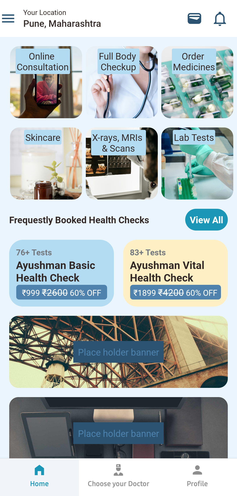
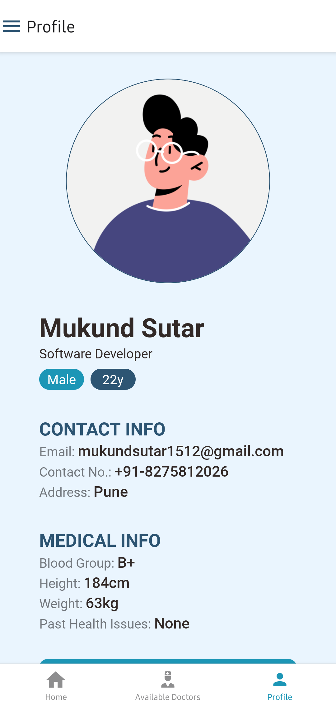
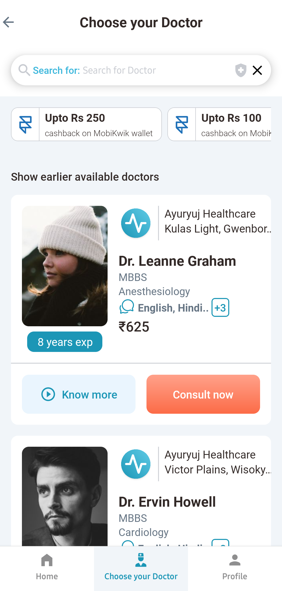
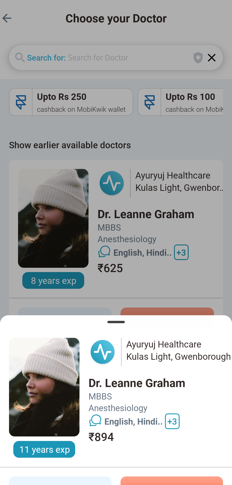
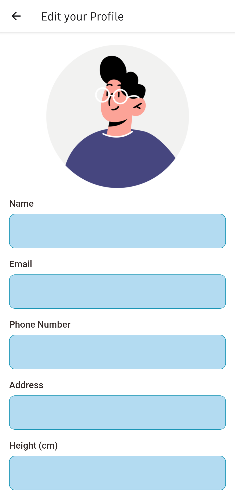

# Project Name

## Description
A React Native mobile application built with Expo.

## Design
Design files can be found in `app-files/design`.

## Screenshots/Design
Screenshots can also be found in `app-files/screenshots`.

<div align="center">
  
  
  
</div>
<div align="center">
  
  
  
</div>

## Installation

### Prerequisites
- Node.js (version 14 or higher)
- npm or yarn
- Expo CLI (`npm install -g expo-cli`)
- Expo Go app on your mobile device (optional, for testing)

### Setup Instructions

1. Clone the repository:
```bash
git clone [repository-url]
cd [project-directory]
```

2. Install dependencies:
```bash
npm install
# or
yarn install
```

3. Start the development server:
```bash
npx expo start -c
```

### Running on Device/Simulator

#### iOS (macOS only)
- Press `i` in the terminal after starting the development server
- Or scan the QR code with your iPhone camera and open in Expo Go (recommended)

#### Android
- Press `a` in the terminal after starting the development server
- Or scan the QR code with Expo Go on your Android device (recommended)
- Alternatively, you can install the pre-built APK from `app-files/build-folder` and download [here](https://expo.dev/artifacts/eas/eRhUvMQth1Ey7FcLcmEJ3R.apk)

## Building the App

### Generate APK
```bash
eas build --profile production
```

### Generate iOS Build
```bash
eas build --profile production
```


## Dependencies
Key dependencies include:
- `react-native`
- `expo`
- `@tanstack/react-query`
- `@shopify/restyle`
- `@gorhom/bottom-sheet`
- `axios`
- `react-native-drawer-layout`
- `react-native-reanimated`
- `@expo-google-fonts/roboto`
